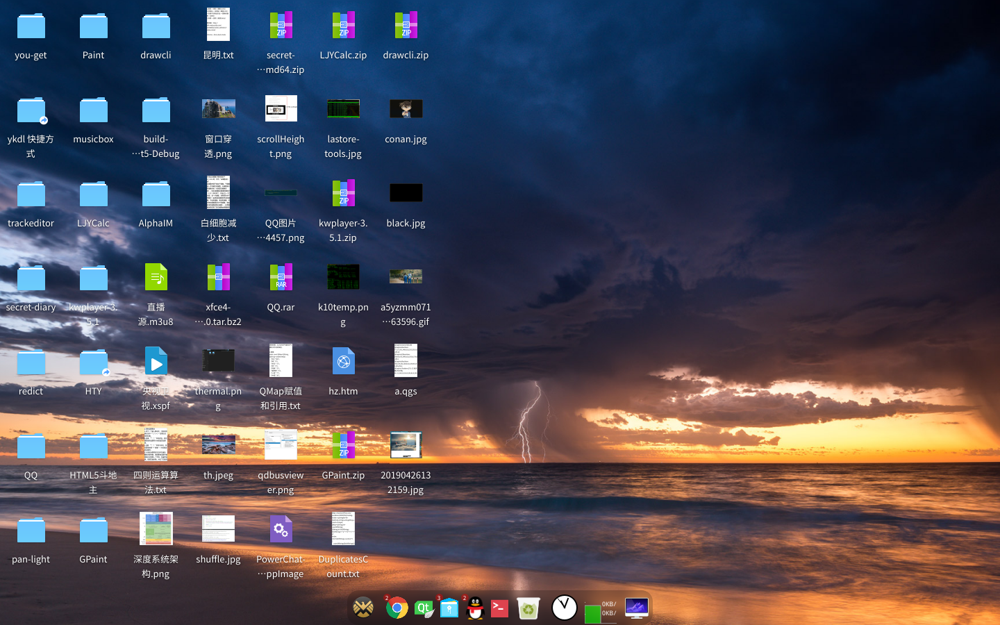

基于 Qt 和 KWindowSystem（窗管、背景模糊）的 Dock 程序。  
已编译的 HTYDock 适用 64 位 Linux Qt>5.11。

### 运行依赖
libkf5windowsystem5

### 编译依赖
libkf5windowsystem-dev qmake make libqt5extras5-dev

### 参考
https://github.com/linuxdeepin/dde-dock  
https://github.com/pandaos/panda-dock  
https://github.com/KDE/latte-dock  
[非系统程序获取图标](https://github.com/linuxdeepin/deepin-system-monitor/blob/117a3b90cb02ecca4990f2136400147c59801dc5/src/utils.cpp#L379)  
[为QWidget创建鼠标点击信号](https://blog.csdn.net/l285345042/article/details/8161320)

### KWindowSystem API
https://api.kde.org/frameworks/kwindowsystem/html/index.html

### 版本日志
V2.0 (2020-04)  
自定义 QWidget 实现悬浮预览窗。  

V1.0 (2020-03)  
使用 QPushButton 做按钮。

### 已知问题
预览窗截图不对：除了深度文管，其他窗口最小化以后都截屏。